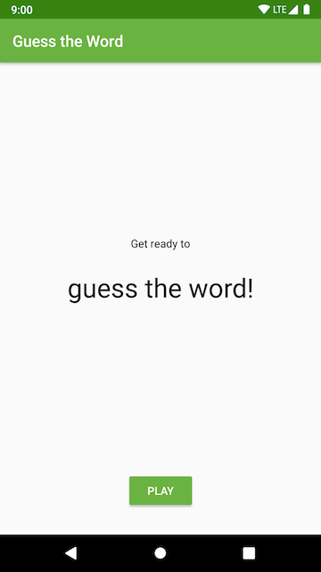
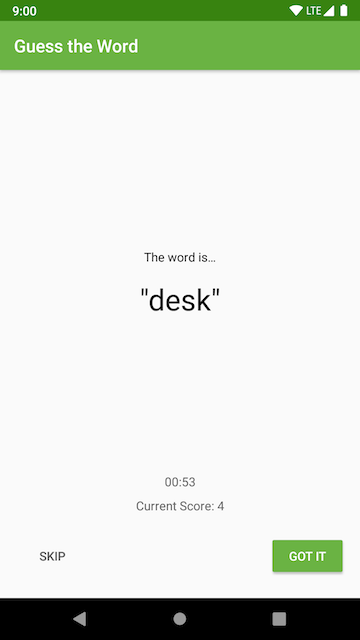

# Application Architecture - The UI Layer - Guess It!
This is the toy app for lesson 5 of the [Android App Development in Kotlin course on Udacity](https://www.udacity.com/course/developing-android-apps-with-kotlin--ud9012).

## Guess It!

Guess It is a word guessing app you can play with one or more friends. To play, hold the device in landscape, facing away from you with your thumbs on the **Skip** and **Got It** buttons. Your friends can then give you clues to help you guess the word. 

If you get the word right, press **Got It**. If you're stuck, press **Skip**. The game runs for a minute and then shows you your score.


## Screenshots

  

## How to use this repo while taking the course

Each code repository in this class has a chain of commits that looks like this:


These commits show every step you'll take to create the app. Each commit contains instructions for completing the step.

Each commit also has a **branch** associated with it of the same name as the commit message, as seen below:


Access all branches from this tab.


The branches are also accessible from the drop-down in the "Code" tab.


## Working with the Course Code

Here are the basic steps for working with and completing exercises in the repo.

The basic steps are:

1. Clone the repo.
2. `checkout` the branch corresponding to the step you want to attempt.
3. Find and complete the TODOs.
4. Optionally commit your code changes.
5. Compare your code with the solution.
6. Repeat steps 2-5 until you've gone trough all the steps to complete the toy app.


**Step 1: Clone the repo**

As you go through the course, you'll be instructed to clone the different exercise repositories, so you don't need to set these up now. You can clone a repository from GitHub in a folder of your choice with the command:

```bash
git clone https://github.com/udacity/REPOSITORY_NAME.git
```

**Step 2: Check out the step branch**

As you go through different steps in the code, you'll be told which step you're on, as well as given a link to the corresponding branch.

Check out the branch associated with that step. The command to check out a branch is:

```bash
git checkout BRANCH_NAME
```

**Step 3: Find and complete the TODOs**

Once you've checked out the branch, you'll have the code in the exact state you need. You'll even have TODOs, which are special comments that tell you all the steps you need to complete the exercise. You can navigate to all the TODOs using Android Studio's TODO tool. To open the TODO tool, click the button at the bottom of the screen that says TODO. This will display a list of all comments with TODO in the project. 

We've numbered the TODO steps so you can do them in order:


**Step 4: Commit your code changes**

After you've completed the TODOs, you can optionally commit your changes. This will allow you to see the code you wrote whenever you return to the branch. The following git code will add and save **all** your changes.

```bash
git add .
git commit -m "Your commit message"
```

**Step 5: Compare with the solution**

Most exercises will have a list of steps for you to check off in the classroom. Once you've checked these off, you'll see a pop up window with a link to the solution code. Note the **Diff** link after the Solution link:


The **Diff** link will take you to a GitHub diff as seen below:


All of the code that was added in the solution is in green, and the removed code (which will usually be the TODO comments) is in red. 

You can also diff your local copy of the code with the corresponding branch as you are working on it:

```bash
git diff BRANCH_NAME
```

## Report Issues
Notice any issues with a repository? Please file a GitHub issue in the repository.

